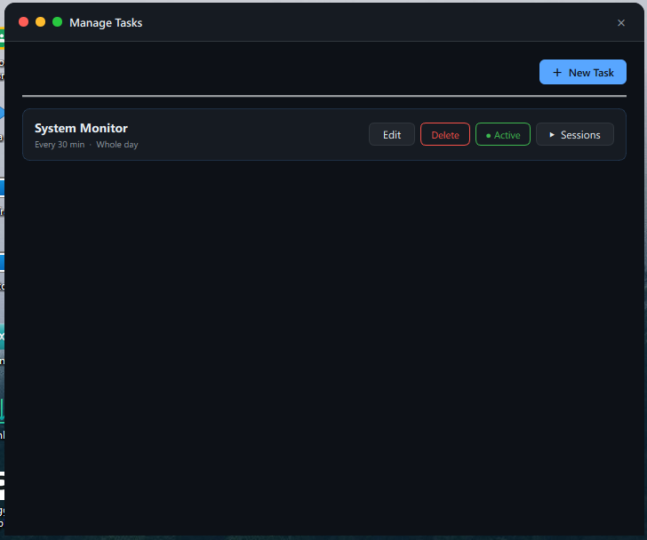
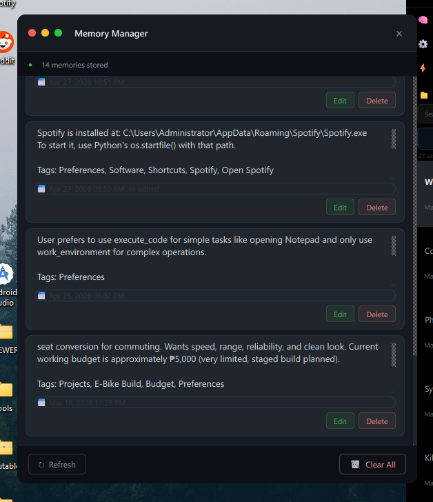
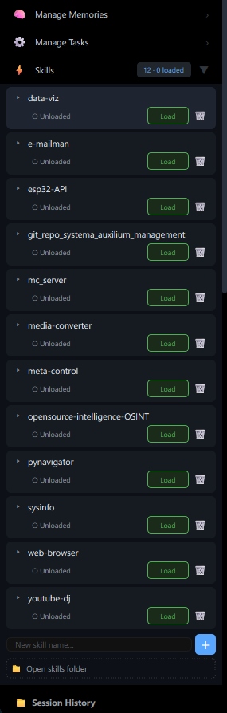
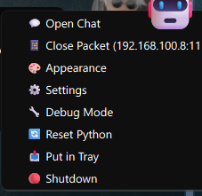
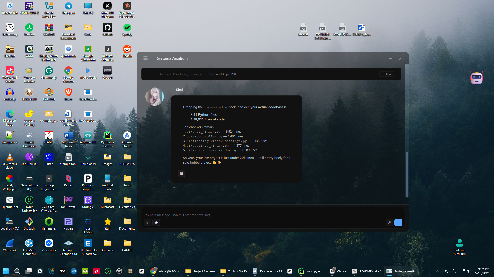
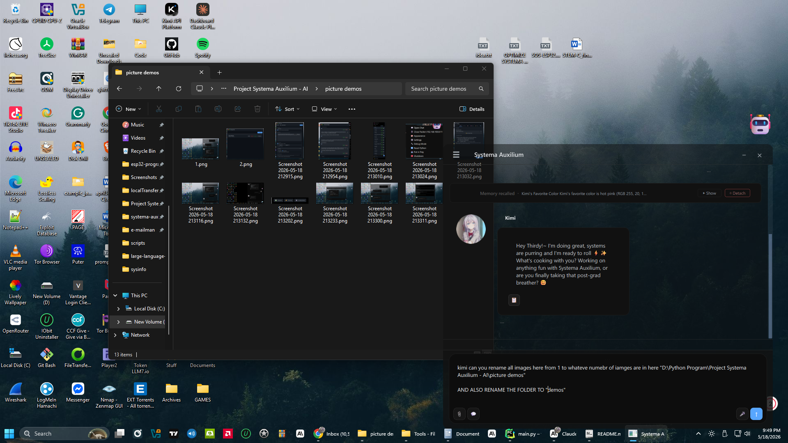
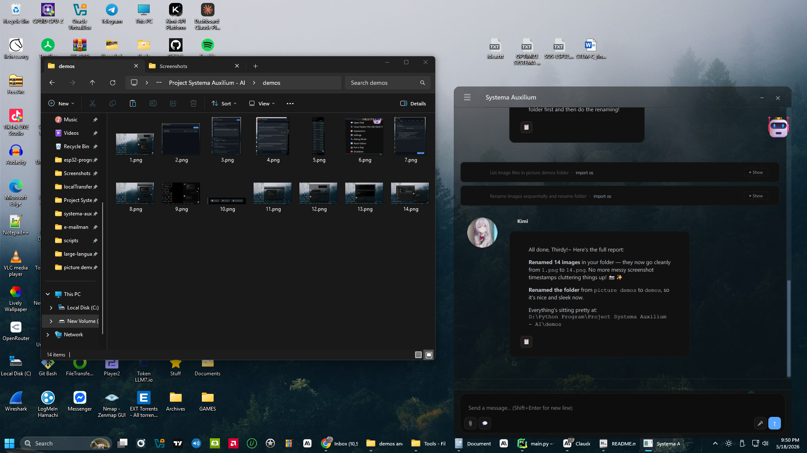

# Systema Auxilium

**License:** MIT

**Author / Architect:** Niccc2007 ([@uukjtisa](https://github.com/uukjtisa))

> ⚠️ **Work in Progress** — This project is actively developed. Not all features are fully polished or tested. Contributions and patience are genuinely appreciated.

---

# Table of Contents
- [Things to take into consideration](#things-to-take-into-consideration)
- [What is Systema Auxilium](#what-is-systema-auxilium)
- [See a Glimpse of It](#see-a-glimpse-of-it)
- [What Can It Do](#what-can-it-do)
- [Modular Provider Architecture](#modular-provider-architecture)
- [Android Bridge App](#android-bridge-app)
- [About AI System Control](#about-ai-system-control)
- [Recommended Python Environment](#recommended-python-environment)
- [How to Install](#how-to-install)
- [Safety Warnings](#safety-warnings)
- [Contributing](#contributing)
- [NOTICE](#notice)

---

## Things to take into consideration.

This is a **hobby project** built and maintained by a single person.

**I only have access to Windows 11 (Main workspace), Windows 10 (VM), and a Kali Linux (VM) (<u>both VMs use Python 3.10</u>), so these are the only platforms I can personally test on. And even then, I can only test one thing at a time, so there may be some other unintended behaviors.**

**Bugs are expected.** Some features have not been deeply tested, and certain functions may behave unexpectedly depending on your setup. And tool calls may leak if the LLM misses proper usage. If something breaks, please try to replicate it and open an issue. Any details you can provide will help a lot. And if you happen to know your way around Python, taking a look at the bug yourself would be even more appreciated! :)

- **Lighter models may struggle to follow the system prompt tool format reliably.**
- **Model instruction following capability matters.** This project was developed and tested with strong frontier models. Smaller or weaker models have not been tested and may produce unreliable tool usage. The modular provider system means you can test any model yourself without waiting for me to integrate it — which is kind of the whole point.
- When the LLM fails to follow the format in tool usage, unintentional results may occur, like tool usage leaking into chat.
- **System Prompt is not perfect.** I am still actively working on analyzing the system prompt to identify redundant and unnecessary instructions.
- I'm open to suggestions for revamping the tool system. If you're experienced in agentic stuff, please consider mentoring me! **:)**

Development happens in whatever time I can spare. Updates may be slow, inconsistent, or temporarily halted during academic periods. I have no prior experience maintaining a codebase of this scale, so there may be structural ambiguity in places. I appreciate your patience.

**Co-authors are welcome.** If you find this project interesting and want to help build it, you are more than welcome. No experience bar. No formality. Just reach out or open a PR.

---

## What is Systema Auxilium?

**Systema Auxilium** (Latin for *"System Helper"*) is an AI-powered desktop assistant that lets you control your computer through plain natural language. Instead of writing scripts or memorizing commands, you simply describe what you want done — and the assistant figures out the Python code to make it happen.

It serves as a personalized companion that helps with general automation, making powerful OS operations accessible to anyone.

---

## 🎬 See a Glimpse of It

<p align="center">
  
  
</p>
<p align="center">
  
  
</p>
<p align="center">
  
  
</p>
<p align="center">
  
  
</p>
<p align="center">
  
  
</p>
<p align="center">
  
  
</p>
<p align="center">
  
  
</p>
<p align="center">
  
</p>

---

## What Can It Do?

Systema Auxilium uses Python to do actual work on your computer. Its capabilities are scoped to what the Python interpreter can do, which is broad, so responsible use and reviewing generated code before execution is strongly encouraged.

**File & Folder Management**
Read, write, create, move, rename, or delete files and directories. Analyse folders, count file types, calculate sizes, list contents — all from a single sentence.

**App & Window Control**
Open, launch, or close applications. Show popups, dialogs, or custom GUI windows. Interact with your desktop environment programmatically.

**System Information & Monitoring**
Check CPU usage, memory, disk space, running processes, system specs, and more.

**Calculations & Data Processing**
Perform complex calculations, process datasets, read and parse files (text, CSV, etc.), and return structured results.

**Voice Mode**
Speak to Systema Auxilium and have it respond via text-to-speech. Supports ElevenLabs out of the box for realistic, emotional voice output — including natural expressions like laughter, sighs, and emphasis — plus any custom TTS provider via the modular script system.

**Modular AI Provider Support**
Every AI backend is a self-contained script you drop into a folder. No hardcoded providers, no codebase changes. See [Modular Provider Architecture](#modular-provider-architecture) below.

**Scheduled Tasks**
Set up persistent background agents that ping the AI on a schedule — even while you're doing something else. Each task has its own instruction, active time window, and ping interval (or specific ping times within that window). Tasks can be paused or activated without deletion, and each runs in its own session context. You can pre-load skills into a task agent so it has specialized knowledge from the moment it starts, and set per-task permissions to control exactly what the agent is allowed to do — like whether it can run code, use work mode, or manage skills. Task agents can send messages directly into your main chat when they have something to report.
IMPORTANT NOTE: Within the scheduled task, code execution calls are approved immediately, so be very careful with your instructions and permissions you allow!

**Session Naming**
The assistant automatically names each conversation session so you can easily navigate back to previous conversations.

**Safe Execution Settings** *(Functional but still being refined — edge cases exist. Suggestions welcome.)*
A safety-first mode that shows you the generated Python code *before* it runs, so you can review, approve, or reject every action.

---

## Modular Provider Architecture

Systema Auxilium uses a **fully modular provider system** for both AI inference and text-to-speech. There is no hardcoded provider list — everything lives as a self-contained Python script in the `providers/` directory.

### How It Works

Each provider is just a Python file implementing a simple contract:

- **LLM providers** (`providers/large-language-models/`) → define `chat(system_prompt, messages) -> str`
  Optional: `chat_image(system_prompt, messages, image_paths)` for vision support
- **TTS providers** (`providers/text-to-speech/`) → define `speak(text, save_to) -> bool`

Drop a script in the right folder, hit Refresh in Settings, and it appears instantly. No codebase edits. No restart required.

### First-Time Setup — Configure a Provider

> **Before you can chat, you need to configure at least one LLM provider.** This is the only real setup step, and it's the same as any other AI platform — you need an API key or access credential for the service you want to use.

Here's how to do it in three steps:

1. Open `providers/large-language-models/` and pick one of the included provider scripts (or copy `_template.py`)
2. Open the file and fill in your API key, model name, or endpoint URL — it's clearly marked at the top of every script
3. In the app: go to **Settings → AI → Active Provider Script**, select your script, and hit **Save Settings**

That's it. If you're unsure how to get an API key for a specific service, just ask any AI assistant — *"How do I get an API key for [provider name]?"* — and you'll have an answer in seconds. The configuration itself is just editing a text file; no Python knowledge required.

This is intentional. Provider configuration lives in the script, not the GUI, because every provider has different fields. It's the same tradeoff every other AI platform makes — and it keeps the codebase clean.

### Included Provider Scripts

The repo ships with several working scripts demonstrating the flexibility of the system:

**LLM:**
- `anthropic_provider.py` — Anthropic Claude API
- `gemini_provider.py` — Google Gemini
- `llm7_io.py` — LLM7.io
- `provider_cloudflare_kimi_k2_6.py` — Cloudflare Workers AI / Kimi K2.6

**TTS:**
- `elevenlabs_tts.py` — Emotional, realistic voice synthesis with expression tags

### Build Your Own in Minutes

Each folder contains a `_template.py` with:
- A ready-to-use `requests`-based implementation skeleton
- Full docstrings explaining the contract
- A **ready-made prompt you can paste into ChatGPT, Claude, or Gemini** to generate a working provider script for your specific API automatically

Translation: *you don't even need to write the Python yourself.* Describe your provider to any AI, paste the output into the folder, reload in Settings, and you're live.

The barrier to adding a new provider is essentially zero.

---

## Android Bridge App

Added: May 5, 2026
Mobile PC Assistant Access - Talk to your assistant from anywhere in your house.
Github repo: [systema-auxilium-android-module](https://github.com/uukjtisa/systema-auxilium-android-module)
Release: [Open](https://github.com/uukjtisa/systema-auxilium-android-module/releases)

---

## About AI System Control

### User Responsibility

Like any powerful tool, Systema Auxilium requires responsible use. Users should understand the commands they're authorizing. The system warns about elevated permissions on startup. Running with minimal necessary privileges and maintaining regular backups is recommended. Whether you write a Python script manually or use an AI assistant — you are ultimately responsible for code execution on your system.

---

## Recommended Python Environment

It is **strongly recommended** to run this project using **Python 3.10.11**, the exact version used during development. Using a different Python version may lead to module incompatibilities or unexpected behavior.

**Official Python 3.10.11 release:** https://www.python.org/downloads/release/python-31011/

**Kali Linux install script I used to install Python 3.10 (use at your own discretion)**

```bash
sudo apt install -y build-essential wget libssl-dev zlib1g-dev \
libncurses5-dev libncursesw5-dev libreadline-dev libsqlite3-dev \
libgdbm-dev libdb5.3-dev libbz2-dev libexpat1-dev liblzma-dev tk-dev

cd /tmp
wget https://www.python.org/ftp/python/3.10.14/Python-3.10.14.tgz
tar -xf Python-3.10.14.tgz
cd Python-3.10.14

./configure --enable-optimizations
make -j$(nproc)
sudo make altinstall
```

---

## How to Install

### Windows
Run `setup.bat` — this will install all dependencies and generate a `run.bat` for you.

Tested on **Windows 11** and **Windows 10**.

### Linux (Debian-based) & macOS
Run `setup.sh` (Linux) or `setup_macOs.sh` (macOS) — these will set up your virtual environment and generate the equivalent helper scripts.

```bash
bash setup.sh       # Linux
bash setup_macOs.sh   # macOS
```

> Mac OS setup script is untested. So far I have only tested the respective setup script for these: Windows 11, 10, and Kali Linux (Python 3.10)

### Manual Setup (any platform)

1. Ensure Python 3.10.11 is installed
2. Install dependencies: `pip install -r requirements.txt`
3. Configure an AI provider — open a script in `providers/large-language-models/`, fill in your credentials, then select it in **Settings → AI**. See [First-Time Setup](#first-time-setup--configure-a-provider) above.
4. Run the application: `python main.py`

---

## Safety Warnings

⚠️ **IMPORTANT SAFETY INFORMATION** ⚠️

- This AI can execute system-level actions if run with sufficient permissions
- Use caution when issuing prompts and commands
- Review generated code before execution (especially once Guided Mode is complete)
- You are responsible for all actions taken by the system
- Consider running in a virtual machine or test environment initially
- Keep regular backups of important data

---

## Contributing

This project is maintained by one person only as of April 25, 2026, and has grown to over 22,000 lines. Contributions of any kind are genuinely welcome — bug reports, feature ideas, pull requests, and general feedback all help.

If you'd like to get involved, please see [CONTRIBUTING.md](CONTRIBUTING.md) or reach out directly.

---

## NOTICE

For authorship, AI tooling disclosure, and legal information, see the [NOTICE](NOTICE) file.

---

**Systema Auxilium** — Niccc2007